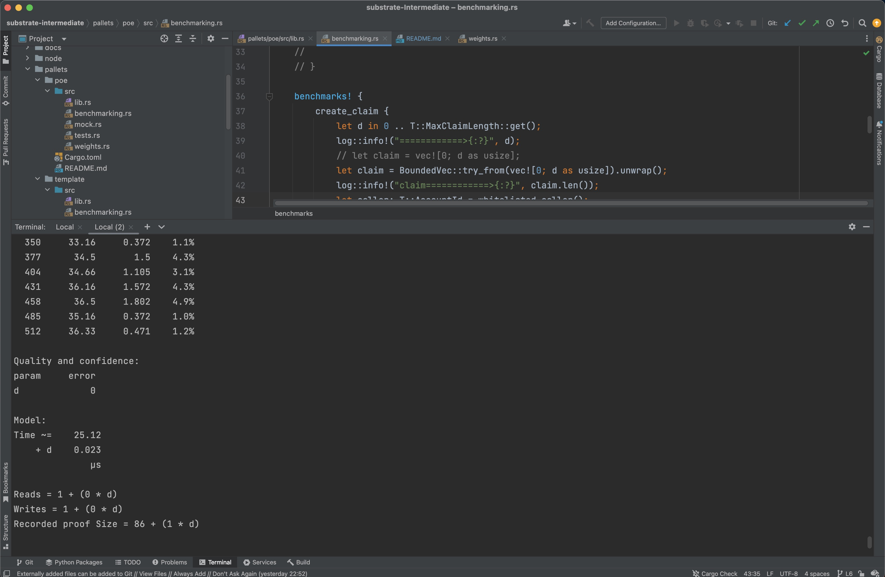
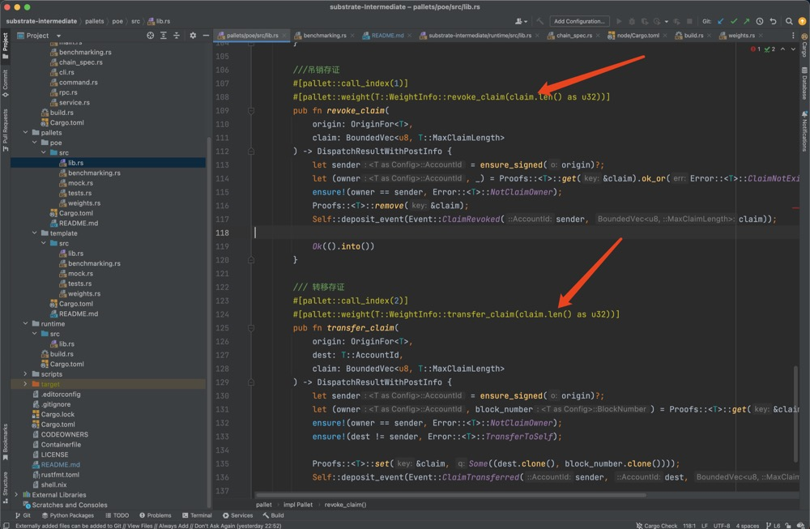

# Substrate 进阶课程作业
generated from substrate-developer-hub/substrate-node-template : polkadot-v0.9.40

[Lesson 1](https://github.com/brrr/substrate-intermediate/tree/L1) `branch: L1`

[Lesson 2](https://github.com/brrr/substrate-intermediate/tree/L2) `branch: L2`

[Lesson 3](https://github.com/brrr/substrate-intermediate/tree/L3) `branch: L3`

[Lesson 4](https://github.com/brrr/substrate-intermediate/tree/L4) `branch: L4`

[Lesson 5](https://github.com/brrr/substrate-intermediate/tree/L5) `branch: L5`

[Lesson 6](https://github.com/brrr/substrate-intermediate/tree/L6) `branch: L6`

## 为 proof of existence (poe) 模块的可调用函数 create_claim, revoke_claim, transfer_claim 添加 benchmark 用例，并且将 benchmark 运行的结果应用在可调用函数上
### 编译runtime-benchmarks feature

```asm
cargo build --release --features runtime-benchmarks
```
### 生成weights

```asm
./target/release/node-template benchmark pallet \
--chain dev \
--execution wasm \
--wasm-execution compiled \
--pallet pallet_poe --extrinsic "*" \
--steps 20 --repeat 10 \
--output ./pallets/poe/src/weights.rs \
--template .maintain/frame-weight-template.hbs
```




## 选择 node-template 或者其它节点程序，生成 Chain Spec 文件（两种格式都需要）

1. 账户准备

<span style="color:red">注意：subkey位置可能不同</span>

```shell
for i in 1 2 3 4 ; do for j in stash controller; do ./subkey inspect "//br//$j//$i"; done; done
```

```text
Secret Key URI `//br//stash//1` is account:
  Network ID:        substrate 
 Secret seed:       0x5ff6ec7e77d580000df6afaf7423650471cc3ef0aae62755ebc99c76a1477da8
  Public key (hex):  0x48e1bd5e0d5b206b6b5205a38e143a608f58c3adb2350d0a6d8f840dabf3d109
  Account ID:        0x48e1bd5e0d5b206b6b5205a38e143a608f58c3adb2350d0a6d8f840dabf3d109
  Public key (SS58): 5DiGN3GxM9LxBXNGTBAchKXG9EEYXJ2jTKAS2cdVyg5VzD4b
  SS58 Address:      5DiGN3GxM9LxBXNGTBAchKXG9EEYXJ2jTKAS2cdVyg5VzD4b
Secret Key URI `//br//controller//1` is account:
  Network ID:        substrate 
 Secret seed:       0x6b989f9ed762f9b030393292c51df60b09d6fcb63f184fbbcabaa1afc0270b6d
  Public key (hex):  0x5edc95b6a28b06c4e525e9df8cb8cd16f9901c72c320344af67911fbe4c79171
  Account ID:        0x5edc95b6a28b06c4e525e9df8cb8cd16f9901c72c320344af67911fbe4c79171
  Public key (SS58): 5ED5tKkWQ3F6b6LUwhgEq21QF1hJng4sD5ruMQyJtJw5jSop
  SS58 Address:      5ED5tKkWQ3F6b6LUwhgEq21QF1hJng4sD5ruMQyJtJw5jSop
Secret Key URI `//br//stash//2` is account:
  Network ID:        substrate 
 Secret seed:       0x3b7f19659a7dde6731d7b963318ecd5aa09365d7b5005d598a8e8b1c8cc608ea
  Public key (hex):  0x5cdcfd7810e7d75358d9ab93141cc2ff96403fafa9eddbb300acf5ddda83253a
  Account ID:        0x5cdcfd7810e7d75358d9ab93141cc2ff96403fafa9eddbb300acf5ddda83253a
  Public key (SS58): 5EATukbozXbq3viTK5vuLxri4yhRUy5mGV7evFjZcS8PGTzu
  SS58 Address:      5EATukbozXbq3viTK5vuLxri4yhRUy5mGV7evFjZcS8PGTzu
Secret Key URI `//br//controller//2` is account:
  Network ID:        substrate 
 Secret seed:       0x9cc0a344f5921f7853ee699565bfb203eddaad142e0b65da2cc5612f184116e7
  Public key (hex):  0xb45c57f132086c56df5333dcb84c33e99adefcc1d00924be5977f83b1fc9fc4c
  Account ID:        0xb45c57f132086c56df5333dcb84c33e99adefcc1d00924be5977f83b1fc9fc4c
  Public key (SS58): 5G9BudKJWiQHKSN2m2p4rJFWhMZES8gWxW75EkvPcmRoyzA8
  SS58 Address:      5G9BudKJWiQHKSN2m2p4rJFWhMZES8gWxW75EkvPcmRoyzA8
Secret Key URI `//br//stash//3` is account:
  Network ID:        substrate 
 Secret seed:       0xcaedf9acfe126c1c275263ba70a3cbb929dd9343109cd01a398b3d18d1552cfc
  Public key (hex):  0xf41ddc84b3db1bda94c73c7ef5ceb498beafbfb18b535fc9da9fd497d22d7f3a
  Account ID:        0xf41ddc84b3db1bda94c73c7ef5ceb498beafbfb18b535fc9da9fd497d22d7f3a
  Public key (SS58): 5HanQqGaNc1tHgT9JT4VPWbZV5zdtyvWWWAKZ7zQBzJNac14
  SS58 Address:      5HanQqGaNc1tHgT9JT4VPWbZV5zdtyvWWWAKZ7zQBzJNac14
Secret Key URI `//br//controller//3` is account:
  Network ID:        substrate 
 Secret seed:       0xdc5ffd4bc827e2a7a4cacacc5515aad0b1ff46785795cab9cc0c34247d83f6e1
  Public key (hex):  0xb80f92c2ea7145cd4e37bc9ac7dd9684d966388beb695568760134b96c4b0731
  Account ID:        0xb80f92c2ea7145cd4e37bc9ac7dd9684d966388beb695568760134b96c4b0731
  Public key (SS58): 5GE3J1sQmaHfYiNbhrUfWx83Y65LyGiUhJtf7zKbfMP1rYt7
  SS58 Address:      5GE3J1sQmaHfYiNbhrUfWx83Y65LyGiUhJtf7zKbfMP1rYt7
Secret Key URI `//br//stash//4` is account:
  Network ID:        substrate 
 Secret seed:       0xce27d35aec7763641dc326806c0b9c1d933808c3281e7334b53501daa6e54908
  Public key (hex):  0x30b0e0b788718ca1d4f55366548f6e84639a7772b704b6c913c1ce4f5b2e6014
  Account ID:        0x30b0e0b788718ca1d4f55366548f6e84639a7772b704b6c913c1ce4f5b2e6014
  Public key (SS58): 5DAYhWj4z7qdWiiSEqdwYL6A9H8jE99KYy17XNwn9zb3BLzR
  SS58 Address:      5DAYhWj4z7qdWiiSEqdwYL6A9H8jE99KYy17XNwn9zb3BLzR
Secret Key URI `//br//controller//4` is account:
  Network ID:        substrate 
 Secret seed:       0xe2a6dc542e91817f9f4b3a0720d72581a387973b2e007827435f511131b8861e
  Public key (hex):  0x4246a2ee5253622eba8044532d3861b927ccfb58db60e9755de1644974667047
  Account ID:        0x4246a2ee5253622eba8044532d3861b927ccfb58db60e9755de1644974667047
  Public key (SS58): 5DZc11UovP2CEBQyGcfGU1wJms14xb7WYspaNbty23sJWpy1
  SS58 Address:      5DZc11UovP2CEBQyGcfGU1wJms14xb7WYspaNbty23sJWpy1

```

```shell
for i in 1 2 3 4 ; do for j in babe; do ./subkey inspect --scheme sr25519 "//br//$j//$i"; done; done
```

```text
Secret Key URI `//br//babe//1` is account:
  Network ID:        substrate 
 Secret seed:       0xac318156606c5f49e4cb4dc74f5cc5d6aaefcd4ac21c907a71c479750683a406
  Public key (hex):  0x86c0a2335342fca26b195116e401dc8cdd4d0412651e00d216cf76fffe50c810
  Account ID:        0x86c0a2335342fca26b195116e401dc8cdd4d0412651e00d216cf76fffe50c810
  Public key (SS58): 5F7PVpzX2Pm6bLHBsmxqqpCpxYcybBoM4BZRrfUujZWtcges
  SS58 Address:      5F7PVpzX2Pm6bLHBsmxqqpCpxYcybBoM4BZRrfUujZWtcges
Secret Key URI `//br//babe//2` is account:
  Network ID:        substrate 
 Secret seed:       0x82146f440d8074e48b7e2f877ef118e8badb2b95a1beffccf32b1d34fbfa1f8e
  Public key (hex):  0xb6106ba2761a95e1d6e4e4ff1330c8b7cccf362c7551ef2c8c72aaf77014ec61
  Account ID:        0xb6106ba2761a95e1d6e4e4ff1330c8b7cccf362c7551ef2c8c72aaf77014ec61
  Public key (SS58): 5GBRT4HR9guYic7PbnRZhsYV1XG9a7apDT3ioA8DXz2gwb1Q
  SS58 Address:      5GBRT4HR9guYic7PbnRZhsYV1XG9a7apDT3ioA8DXz2gwb1Q
Secret Key URI `//br//babe//3` is account:
  Network ID:        substrate 
 Secret seed:       0xc566bd1d12a478bef5d246a83e6d9616d296d8fb446a1e1d9337395226f02634
  Public key (hex):  0xea6678f34ea9be651bf0e1ae637ec4574d7a26ee640c607cf15d0388b5641018
  Account ID:        0xea6678f34ea9be651bf0e1ae637ec4574d7a26ee640c607cf15d0388b5641018
  Public key (SS58): 5HN3W7ssoe47CmU89rtAqpKkTpoqFzaDT8PqrqJt86STTP3g
  SS58 Address:      5HN3W7ssoe47CmU89rtAqpKkTpoqFzaDT8PqrqJt86STTP3g
Secret Key URI `//br//babe//4` is account:
  Network ID:        substrate 
 Secret seed:       0x28efc8ba5716e868b963f6af76851c1bd0d2ae271e948778602ae4a7f2da4518
  Public key (hex):  0xfefb8e07765fa92bbe89b629529378f581a4d5efd5b41239028a57697fbdbd7b
  Account ID:        0xfefb8e07765fa92bbe89b629529378f581a4d5efd5b41239028a57697fbdbd7b
  Public key (SS58): 5Hq2kJ36Zd5yDcGpRyCqjAawBytrVzxTwckpiCEFGCsiWyf4
  SS58 Address:      5Hq2kJ36Zd5yDcGpRyCqjAawBytrVzxTwckpiCEFGCsiWyf4

```

```shell
for i in 1 2 3 4 ; do for j in grandpa; do ./subkey inspect --scheme ed25519 "//br//$j//$i"; done; done
```

```text
Secret Key URI `//br//grandpa//1` is account:
  Network ID:        substrate 
 Secret seed:       0x8f195164a892eacf4a89b773f2487c8d5805716474dfe70f5e29b612b61f1b70
  Public key (hex):  0x954725588edbe2424653adc35c51e3196cedd3449cea9fd583aa5866a9056848
  Account ID:        0x954725588edbe2424653adc35c51e3196cedd3449cea9fd583aa5866a9056848
  Public key (SS58): 5FSS8JYr3s5v8sAcXbngyuuPQ7MjmEDfrvyqwtd23E5tYm4Z
  SS58 Address:      5FSS8JYr3s5v8sAcXbngyuuPQ7MjmEDfrvyqwtd23E5tYm4Z
Secret Key URI `//br//grandpa//2` is account:
  Network ID:        substrate 
 Secret seed:       0x0e08d063afbbcb53a576c1b0bb5fb5a9f7812538bdc2a6528541f4a732573539
  Public key (hex):  0x6fabca0de9bd264db20116293bf623f47d43de010b3fd891fc615cd94f7799cb
  Account ID:        0x6fabca0de9bd264db20116293bf623f47d43de010b3fd891fc615cd94f7799cb
  Public key (SS58): 5Eb8Coyhpa9iCkGbYvHXuXhY9zPjdKfrYqPtY7n3mVT8HW2T
  SS58 Address:      5Eb8Coyhpa9iCkGbYvHXuXhY9zPjdKfrYqPtY7n3mVT8HW2T
Secret Key URI `//br//grandpa//3` is account:
  Network ID:        substrate 
 Secret seed:       0xca9556aa56011e6ae3bd2640f7854fb8724facbb295f4d3e94d542b30575371e
  Public key (hex):  0xdb7b4532a0378b1fe452bfa6c5a0eb45ad7255ce679bb84e60daa9faf48230c5
  Account ID:        0xdb7b4532a0378b1fe452bfa6c5a0eb45ad7255ce679bb84e60daa9faf48230c5
  Public key (SS58): 5H2UxoFFYtwXTYpEWc7Ww5P91dW2vkU9cPdZc9aSGGqYiR2J
  SS58 Address:      5H2UxoFFYtwXTYpEWc7Ww5P91dW2vkU9cPdZc9aSGGqYiR2J
Secret Key URI `//br//grandpa//4` is account:
  Network ID:        substrate 
 Secret seed:       0x7c3bcccb1c39a9d84d8dfd50b7c32dd78136404a5bf8fc578c46bcb8b114cfd1
  Public key (hex):  0x5fe8a76ef50dba942242a29476bccb19f4c6bde8d6820331bbeebce2edc42833
  Account ID:        0x5fe8a76ef50dba942242a29476bccb19f4c6bde8d6820331bbeebce2edc42833
  Public key (SS58): 5EETX3onKHPat4ug6kbasmwZDJqhznBnR96W9tXuMSJncZTE
  SS58 Address:      5EETX3onKHPat4ug6kbasmwZDJqhznBnR96W9tXuMSJncZTE

```
# Substrate Node Template

A fresh [Substrate](https://substrate.io/) node, ready for hacking :rocket:

A standalone version of this template is available for each release of Polkadot in the [Substrate Developer Hub Parachain Template](https://github.com/substrate-developer-hub/substrate-parachain-template/) repository.
The parachain template is generated directly at each Polkadot release branch from the [Node Template in Substrate](https://github.com/paritytech/substrate/tree/master/bin/node-template) upstream

It is usually best to use the standalone version to start a new project.
All bugs, suggestions, and feature requests should be made upstream in the [Substrate](https://github.com/paritytech/substrate/tree/master/bin/node-template) repository.

## Getting Started

Depending on your operating system and Rust version, there might be additional packages required to compile this template.
Check the [installation](https://docs.substrate.io/install/) instructions for your platform for the most common dependencies.
Alternatively, you can use one of the [alternative installation](#alternative-installations) options.

### Build

Use the following command to build the node without launching it:

```sh
cargo build --release
```

### Embedded Docs

After you build the project, you can use the following command to explore its parameters and subcommands:

```sh
./target/release/node-template -h
```

You can generate and view the [Rust Docs](https://doc.rust-lang.org/cargo/commands/cargo-doc.html) for this template with this command:

```sh
cargo +nightly doc --open
```

### Single-Node Development Chain

The following command starts a single-node development chain that doesn't persist state:

```sh
./target/release/node-template --dev
```

To purge the development chain's state, run the following command:

```sh
./target/release/node-template purge-chain --dev
```

To start the development chain with detailed logging, run the following command:

```sh
RUST_BACKTRACE=1 ./target/release/node-template -ldebug --dev
```

Development chains:

- Maintain state in a `tmp` folder while the node is running.
- Use the **Alice** and **Bob** accounts as default validator authorities.
- Use the **Alice** account as the default `sudo` account.
- Are preconfigured with a genesis state (`/node/src/chain_spec.rs`) that includes several prefunded development accounts.

To persist chain state between runs, specify a base path by running a command similar to the following:

```sh
// Create a folder to use as the db base path
$ mkdir my-chain-state

// Use of that folder to store the chain state
$ ./target/release/node-template --dev --base-path ./my-chain-state/

// Check the folder structure created inside the base path after running the chain
$ ls ./my-chain-state
chains
$ ls ./my-chain-state/chains/
dev
$ ls ./my-chain-state/chains/dev
db keystore network
```

### Connect with Polkadot-JS Apps Front-End

After you start the node template locally, you can interact with it using the hosted version of the [Polkadot/Substrate Portal](https://polkadot.js.org/apps/#/explorer?rpc=ws://localhost:9944) front-end by connecting to the local node endpoint.
A hosted version is also available on [IPFS (redirect) here](https://dotapps.io/) or [IPNS (direct) here](ipns://dotapps.io/?rpc=ws%3A%2F%2F127.0.0.1%3A9944#/explorer).
You can also find the source code and instructions for hosting your own instance on the [polkadot-js/apps](https://github.com/polkadot-js/apps) repository.

### Multi-Node Local Testnet

If you want to see the multi-node consensus algorithm in action, see [Simulate a network](https://docs.substrate.io/tutorials/get-started/simulate-network/).

## Template Structure

A Substrate project such as this consists of a number of components that are spread across a few directories.

### Node

A blockchain node is an application that allows users to participate in a blockchain network.
Substrate-based blockchain nodes expose a number of capabilities:

- Networking: Substrate nodes use the [`libp2p`](https://libp2p.io/) networking stack to allow the
  nodes in the network to communicate with one another.
- Consensus: Blockchains must have a way to come to [consensus](https://docs.substrate.io/fundamentals/consensus/) on the state of the network.
  Substrate makes it possible to supply custom consensus engines and also ships with several consensus mechanisms that have been built on top of [Web3 Foundation research](https://research.web3.foundation/en/latest/polkadot/NPoS/index.html).
- RPC Server: A remote procedure call (RPC) server is used to interact with Substrate nodes.

There are several files in the `node` directory.
Take special note of the following:

- [`chain_spec.rs`](./node/src/chain_spec_bk): A [chain specification](https://docs.substrate.io/build/chain-spec/) is a source code file that defines a Substrate chain's initial (genesis) state.
  Chain specifications are useful for development and testing, and critical when architecting the launch of a production chain.
  Take note of the `development_config` and `testnet_genesis` functions.
  These functions are used to define the genesis state for the local development chain configuration.
  These functions identify some [well-known accounts](https://docs.substrate.io/reference/command-line-tools/subkey/) and use them to configure the blockchain's initial state.
- [`service.rs`](./node/src/service.rs): This file defines the node implementation.
  Take note of the libraries that this file imports and the names of the functions it invokes.
  In particular, there are references to consensus-related topics, such as the [block finalization and forks](https://docs.substrate.io/fundamentals/consensus/#finalization-and-forks) and other [consensus mechanisms](https://docs.substrate.io/fundamentals/consensus/#default-consensus-models) such as Aura for block authoring and GRANDPA for finality.

### Runtime

In Substrate, the terms "runtime" and "state transition function" are analogous.
Both terms refer to the core logic of the blockchain that is responsible for validating blocks and executing the state changes they define.
The Substrate project in this repository uses [FRAME](https://docs.substrate.io/fundamentals/runtime-development/#frame) to construct a blockchain runtime.
FRAME allows runtime developers to declare domain-specific logic in modules called "pallets".
At the heart of FRAME is a helpful [macro language](https://docs.substrate.io/reference/frame-macros/) that makes it easy to create pallets and flexibly compose them to create blockchains that can address [a variety of needs](https://substrate.io/ecosystem/projects/).

Review the [FRAME runtime implementation](./runtime/src/lib.rs) included in this template and note the following:

- This file configures several pallets to include in the runtime.
  Each pallet configuration is defined by a code block that begins with `impl $PALLET_NAME::Config for Runtime`.
- The pallets are composed into a single runtime by way of the [`construct_runtime!`](https://crates.parity.io/frame_support/macro.construct_runtime.html) macro, which is part of the core FRAME Support [system](https://docs.substrate.io/reference/frame-pallets/#system-pallets) library.

### Pallets

The runtime in this project is constructed using many FRAME pallets that ship with the [core Substrate repository](https://github.com/paritytech/substrate/tree/master/frame) and a template pallet that is [defined in the `pallets`](./pallets/template/src/lib.rs) directory.

A FRAME pallet is compromised of a number of blockchain primitives:

- Storage: FRAME defines a rich set of powerful [storage abstractions](https://docs.substrate.io/build/runtime-storage/) that makes it easy to use Substrate's efficient key-value database to manage the evolving state of a blockchain.
- Dispatchables: FRAME pallets define special types of functions that can be invoked (dispatched) from outside of the runtime in order to update its state.
- Events: Substrate uses [events and errors](https://docs.substrate.io/build/events-and-errors/) to notify users of important changes in the runtime.
- Errors: When a dispatchable fails, it returns an error.
- Config: The `Config` configuration interface is used to define the types and parameters upon which a FRAME pallet depends.

## Alternative Installations

Instead of installing dependencies and building this source directly, consider the following alternatives.

### CI

#### Binary

Check the [CI release workflow](./.github/workflows/release.yml) to see how the binary is built on CI.
You can modify the compilation targets depending on your needs.

Allow GitHub actions in your forked repository to build the binary for you.

Push a tag. For example, `v0.1.1`. Based on [Semantic Versioning](https://semver.org/), the supported tag format is `v?MAJOR.MINOR.PATCH(-PRERELEASE)?(+BUILD_METADATA)?` (the leading "v", pre-release version, and build metadata are optional and the optional prefix is also supported).

After the pipeline is finished, you can download the binary from the releases page.

#### Container

Check the [CI release workflow](./.github/workflows/release.yml) to see how the Docker image is built on CI.

Add your `DOCKERHUB_USERNAME` and `DOCKERHUB_TOKEN` secrets or other organization settings to your forked repository.
Change the `DOCKER_REPO` variable in the workflow to `[your DockerHub registry name]/[image name]`.

Push a tag.

After the image is built and pushed, you can pull it with `docker pull <DOCKER_REPO>:<tag>`.

### Nix

Install [nix](https://nixos.org/), and optionally [direnv](https://github.com/direnv/direnv) and [lorri](https://github.com/nix-community/lorri) for a fully plug-and-play experience for setting up the development environment.
To get all the correct dependencies, activate direnv `direnv allow` and lorri `lorri shell`.

### Docker

Please follow the [Substrate Docker instructions here](https://github.com/paritytech/substrate/blob/master/docker/README.md) to build the Docker container with the Substrate Node Template binary.
